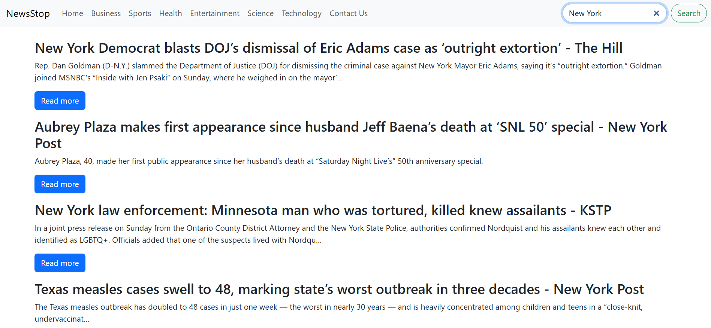

## 📰 News Monkey

News Monkey is a React-based web application that fetches the latest news articles from a news API. It provides categorized news sections (like Business, Sports, Entertainment, and Technology) and includes a search feature to explore specific topics.

## 🚀 Features
📡 Fetches real-time news from an external API
🗂️ Different sections/categories (Business, Sports, Entertainment, Health, Technology, etc.)
🔍 Search option for finding articles by keyword
📱 Responsive design for desktop and mobile
⚡ Built with React and modern hooks (useEffect, useState)

## 📸 Screenshots

### 🏠 Home Page

### 🗂️ Category View

